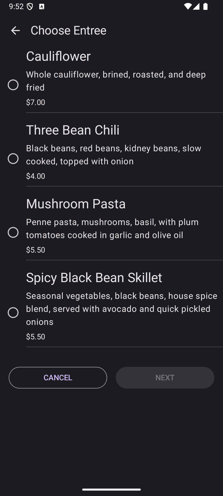
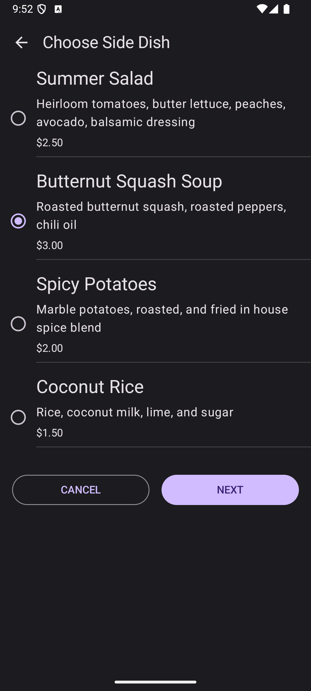
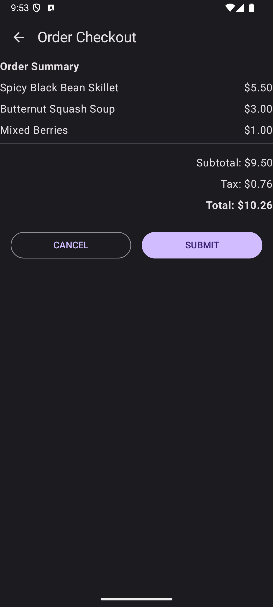

# 🍽️ Lunch Tray App

## 📌 Overview
A simple Jetpack Compose app for selecting and ordering a lunch meal! Users can pick an entrée, side dish, and accompaniment, then review and checkout. 🍛🥗🍰

## 🎯 Features
✅ Select an entrée, side dish, and accompaniment.  
✅ Navigate through menu screens.  
✅ View order summary before checkout.  
✅ Simple and user-friendly UI.

## 📷Images

## 🔗 Dependencies
- **Jetpack Compose** (UI framework)
- **Material 3** (Modern UI components)
- **Navigation Compose** (Screen transitions)

## 🛠️ Usage
1️⃣ **Start Order** 🏁  
2️⃣ **Pick your meal** 🍽️  
3️⃣ **Review Order** 📝  
4️⃣ **Submit or Cancel** ✅❌

## 📜 License
Licensed under **Apache License 2.0**. See the LICENSE file for details.

